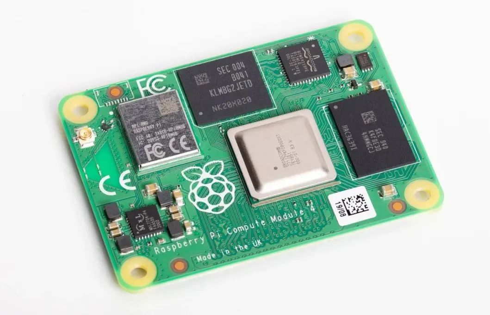

# RaspberryPi CM4

# 

- 搭建Raspberry CM4 使用Linux（Ubuntu/Ukylin、RaspberryPi、OpenWrt）和Android（LineageOS）的使用环境
- 在以上环境的基础上使用Quectel的LTE和5G模组

[`知识总结`](<https://QuectelWB.github.io>)
[`Quectel标准模组使用指南`](<https://QuectelWB.github.com/STD_Modules>)
[移远产品中文论坛](<https://forumschinese.quectel.com/>)
[Start](README.md)
